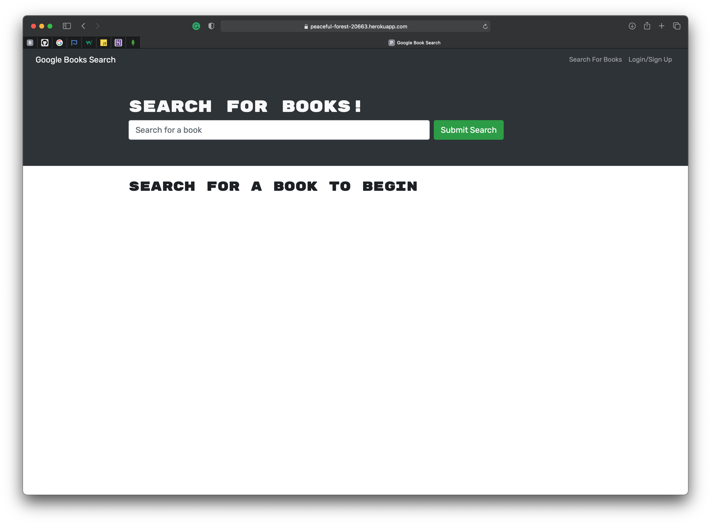
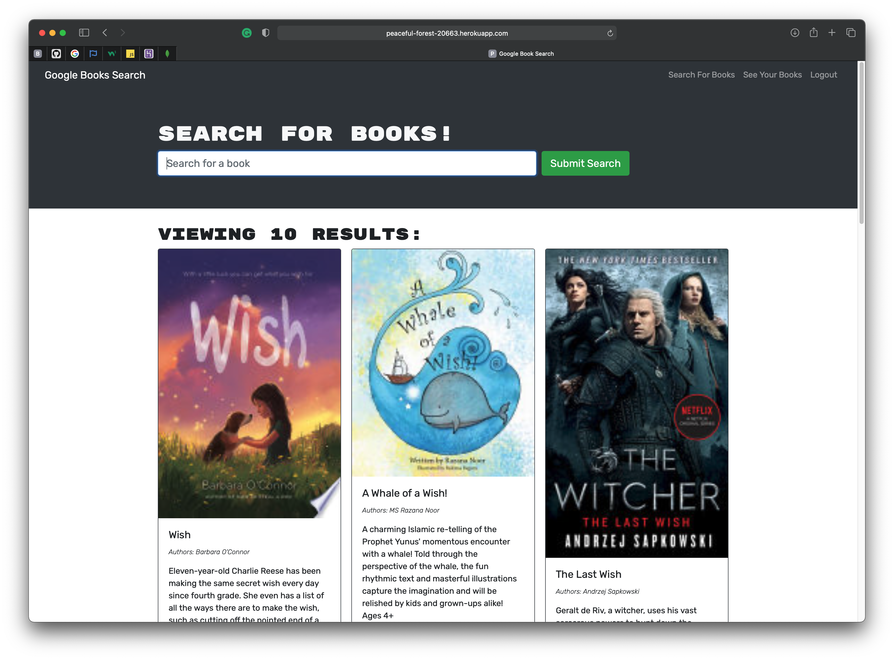
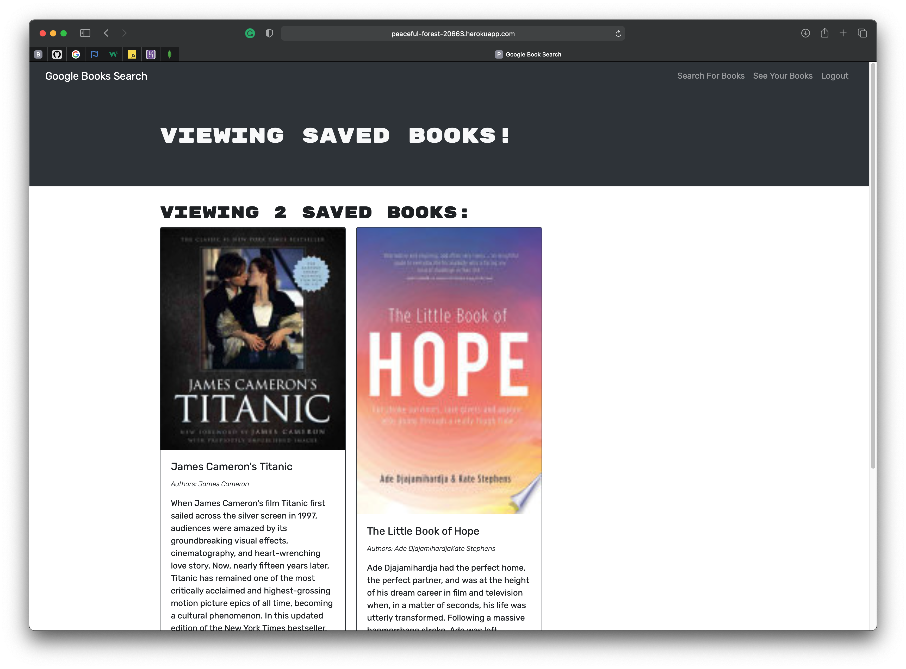

  
Table of Contents

  <ol>
    <li><a href="#description">Description</a></li>
    <li><a href="#live-url">Live URL</a></li>
    <li><a href="#features">Features</a></li>
    <li><a href="#technical-part">Technical Part</a>
        <ul>
            <li><a href="#demo">Demo</a></li>
            <li><a href="#installation">Installation</a></li>
            <li><a href="#usage">Usage</a></li>
            <li><a href="#contributing">Contributing</a></li>
        </ul>
    </li>
    <li><a href="#questions">Questions</a></li>
    <li><a href="#license">License</a></li>
    <li><a href="#notes">Notes</a></li>
  </ol>

## Description

Book Search is a Google Books API powered search engine that was built with GraphQL and Apollo Server. User can search books and save favorite books if user created an account.

The app was built using the MERN stack with a React front end, MongoDB database, and Node.js/Express.js server and API.

## Live URL

https://peaceful-forest-20663.herokuapp.com

## Features

- JavaScript
- Node.js
- Express.js
- MongoDB
- npm
- GraphQL
- React
- Apollo Server

## Technical Part

### _Demo_

The screenshots below show the website previews:

### _Installation_

1. Download or clone repository.
2. [**Node.js**](https://nodejs.org/en/about/) and [**MongoDB**](https://www.mongodb.com/try/download/community) are required to run the application.
3. Run `npm install` in the Terminal to install the required npm packages

### _Usage_

- To start using the application, input the following in your Terminal

  `npm run develop`

- Navigate to `http://localhost:3000/` in your browser to see the client
- Or `http://localhost:3001/graphql` to access the GraphQL

- Enjoy!

### _Contributing_

Pull requests are welcome. For major changes, please open an issue first to discuss what you would like to change, so I learn and understand it better.

Please make sure to update tests as appropriate, if applicable.

## Questions

- Checkout my [GitHub profile](https://github.com/KorolyovaLara)
- Any additional questions or feedback, feel free to [send an email](mailto:larakorolyova@gmail.com).

## License

Copyright (c) [Larysa Korolyova](https://www.linkedin.com/in/korolyova/). All rights reserved.

Licensed under the [MIT](https://github.com/KorolyovaLara/Apollo-GraphQL-Book-Search-Engine/blob/main/LICENSE) license.

---

### Notes

Quote that recently inspired me:

> You never know what worse luck your bad luck has saved you from. -_Cormac McCarthy_

---

© 2021 L Korolyova
